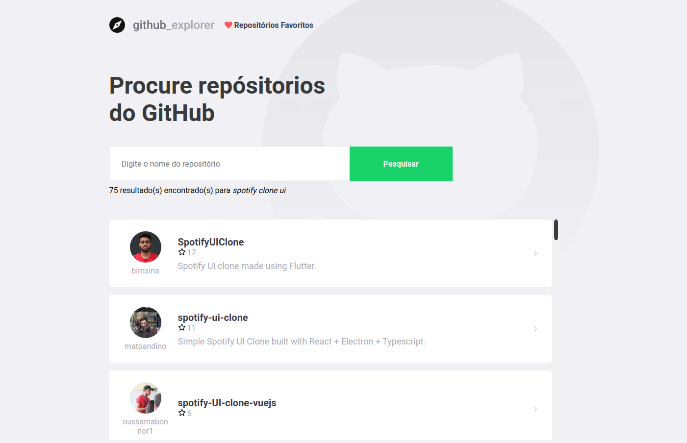

<p align="center">
  <a>
    
  </a>
</p>

# Github Repository Explorer Frontend

## Features

- Pesquise repositórios do GitHub;
- Veja o repositório individualmente e outros projetos do autor;
- Favorite os repositórios e depois veja eles em "Repositórios Favoritos";
- Repositórios favoritados são salvos localmente.

## Instalação

Para rodar o projeto será necessário instalar o **Node.js** na sua máquina.

Use o gerenciador de pacotes da sua escolha (npm, yarn, etc.) para instalar todas as dependências.

Altere a url base da API que será consumida em **.env**  => "REACT_APP_API=BASE_URL_AQUI". Caso não seja passada nenhuma url, por default será "http://localhost:8080/".

### Instalação Padrão

Para rodar em modo de desenvolvimento:

```
// Clone o repositório
git clone https://github.com/matpandino/github-repository-explorer.git


// Vá para o diretório do front-end
cd github-repository-explorer/frontend/


// Instale as dependências

// yarn
yarn install
// npm
npm install


// Rodar a aplicação

// yarn
yarn start
// npm
npm start
```

### Criando imagem e rodando com Docker

Para prosseguir será necessário Docker instalado na sua máquina.


#### Via Imagem no DockerHub já existente

```
// Baixe a imagem do repositório
docker pull matpandino/github-explorer-frontend:latest

// Rode a imagem do Projeto
docker run -d -p 80:80 -t matpandino/github-explorer-frontend:latest
```

#### Localmente


```
// Clone o repositório
git clone https://github.com/matpandino/github-repository-explorer.git


// Vá para o diretório do front-end
cd github-repository-explorer/frontend/


// Instale as dependências

// yarn
yarn install
// npm
npm install


// Gere a build do projeto

// yarn
yarn build
// npm
npm build


// Crie a imagem Docker
docker build --rm -f Dockerfile -t github-repository-explorer:latest .


// Rode a imagem
docker run --rm -d -p 80:80 github-repository-explorer:latest
```

## Imagens

<p align="center">
  <a>
    
  </a>
</p>
